# Project 04 – Identity Lifecycle Management

## Overview

This project demonstrates the complete identity lifecycle within an enterprise Active Directory environment by simulating common Identity and Access Management (IAM) operations.

The objective was to provision, modify, and deprovision user identities while maintaining the Principle of Least Privilege and ensuring access aligned with changing business requirements.

The project follows a standard Joiner–Mover–Leaver (JML) model commonly used by enterprise IAM teams.

---

# Objectives

- Provision new user identities
- Populate identity attributes
- Assign role-based access
- Validate provisioning
- Process department transfers
- Modify access based on business role changes
- Deprovision terminated employees
- Remove unnecessary permissions
- Preserve disabled accounts for auditing and retention

---

# Environment

| Component | Value |
|-----------|-------|
| Domain | corp.cyberlab.local |
| Domain Controller | SF-DC01 |
| Platform | Windows Server 2022 |
| Directory Service | Active Directory Domain Services |
| Virtualization | VMware Workstation Pro |

---

# Identity Lifecycle

## Joiner

A new employee, **Maria Lopez**, was onboarded into the Finance department.

Provisioning included:

- User account creation
- Identity attribute population
- Manager assignment
- Department assignment
- Company assignment
- Password change required at first logon
- Security group assignment
- Provisioning validation

### Business Request

Ticket: IAM-001

```
Employee:
Maria Lopez

Department:
Finance

Title:
Financial Analyst

Manager:
Olivia Brown

Requested Access

• Standard domain account
• Finance department access
• Finance security resources

Status:
Approved
```

---

## Mover

Maria Lopez transferred from Finance to Operations.

The identity lifecycle included:

- Department update
- Manager update
- Job title update
- Organizational Unit relocation
- Removal of Finance security group
- Assignment of Operations security group
- Access validation

### Business Request

Ticket: IAM-002

```
Employee:
Maria Lopez

Old Department:
Finance

New Department:
Operations

Title:
Operations Analyst

Manager:
Daniel Garcia

Status:
Approved
```

---

## Leaver

Maria Lopez's employment ended.

The deprovisioning workflow included:

- Account disabled
- Department access removed
- Security group removed
- Account retained
- Account moved into Disabled Accounts Organizational Unit

### Business Request

Ticket: IAM-003

```
Employee:
Maria Lopez

Termination Date:
July 26, 2026

Actions Requested

• Disable account
• Remove department access
• Preserve account
• Move to Disabled Accounts

Status:
Approved
```

---

# Skills Demonstrated

- Active Directory Administration
- Identity Provisioning
- Identity Deprovisioning
- Joiner–Mover–Leaver (JML)
- Role-Based Access Control (RBAC)
- Organizational Unit Administration
- Security Group Management
- Least Privilege
- Identity Validation
- Access Modification
- Enterprise Documentation

---

# Screenshots

## Joiner

### User Provisioned

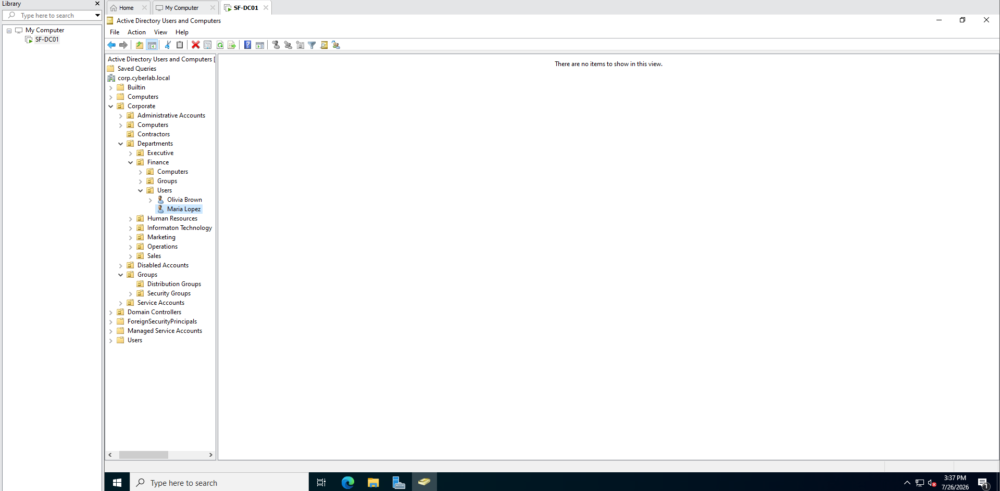

**Figure 1.** New employee account successfully provisioned inside the Finance Users Organizational Unit.

---

### Identity Attributes

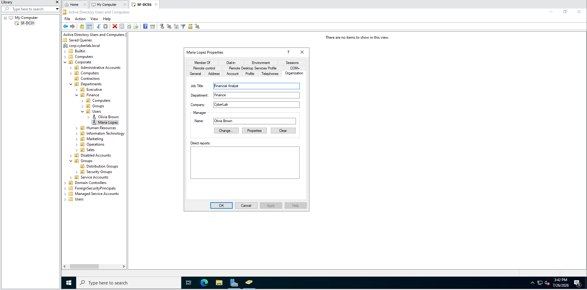

**Figure 2.** Business identity attributes including title, department, manager, and company.

---

### Role Assignment

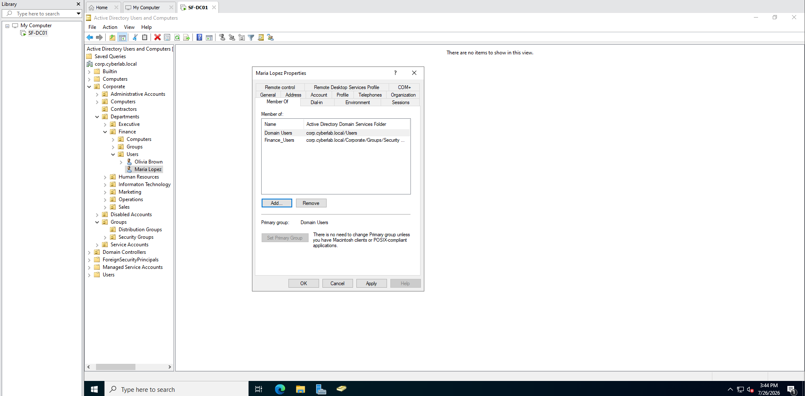

**Figure 3.** User assigned to the Finance security group following Role-Based Access Control principles.

---

### Provision Validation

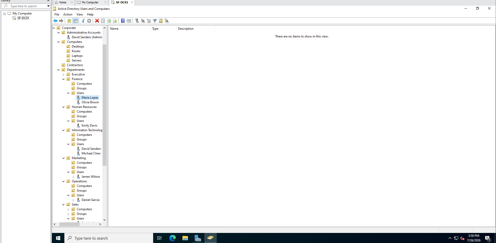

**Figure 4.** Completed provisioning validated inside the Finance Users Organizational Unit.

---

## Mover

### Previous Access

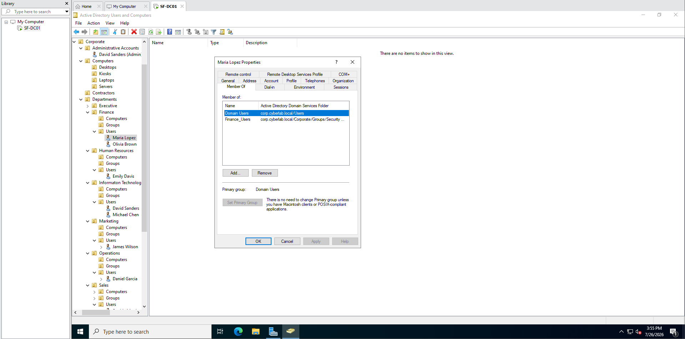

**Figure 5.** Existing Finance access before department transfer.

---

### Updated Identity

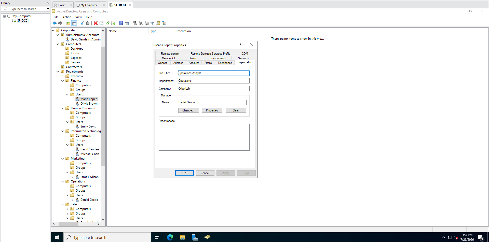

**Figure 6.** Identity attributes updated to reflect the employee's new role.

---

### Organizational Unit Transfer

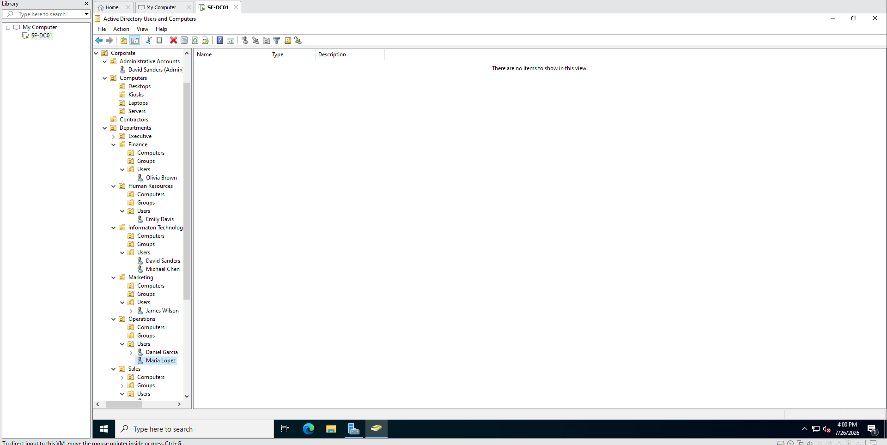

**Figure 7.** User relocated to the Operations Organizational Unit.

---

### Updated Access

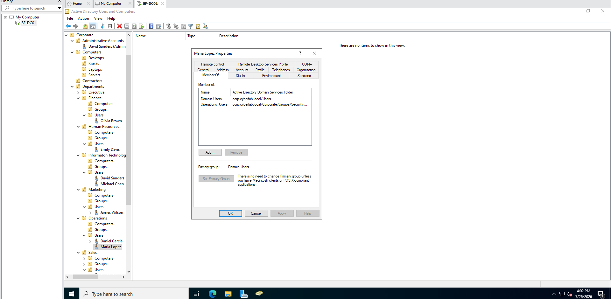

**Figure 8.** Department access modified by replacing Finance group membership with Operations group membership.

---

## Leaver

### Account Disabled

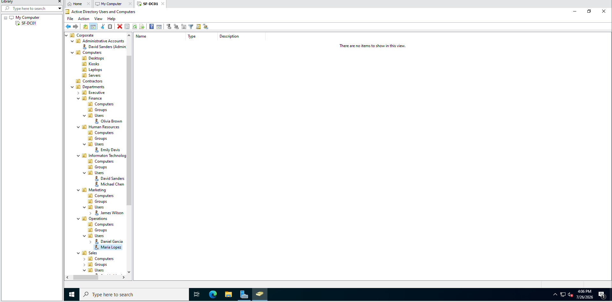

**Figure 9.** Employee account disabled immediately following termination.

---

### Department Access Removed

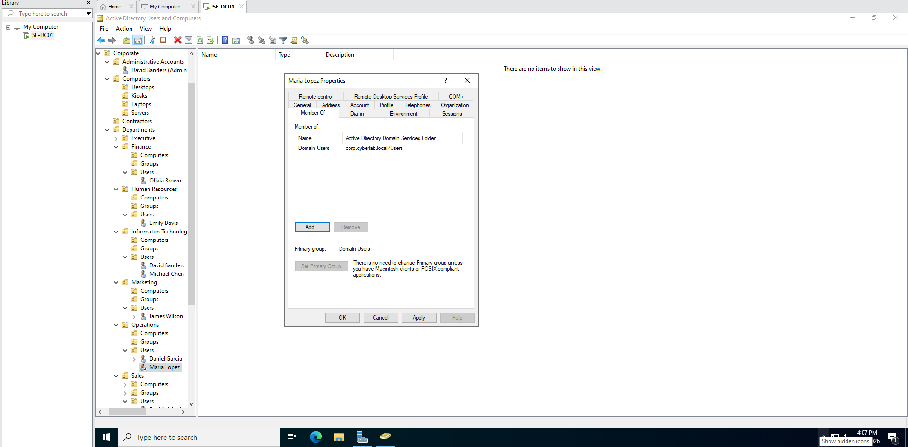

**Figure 10.** Department-specific security access removed during offboarding.

---

### Disabled Accounts

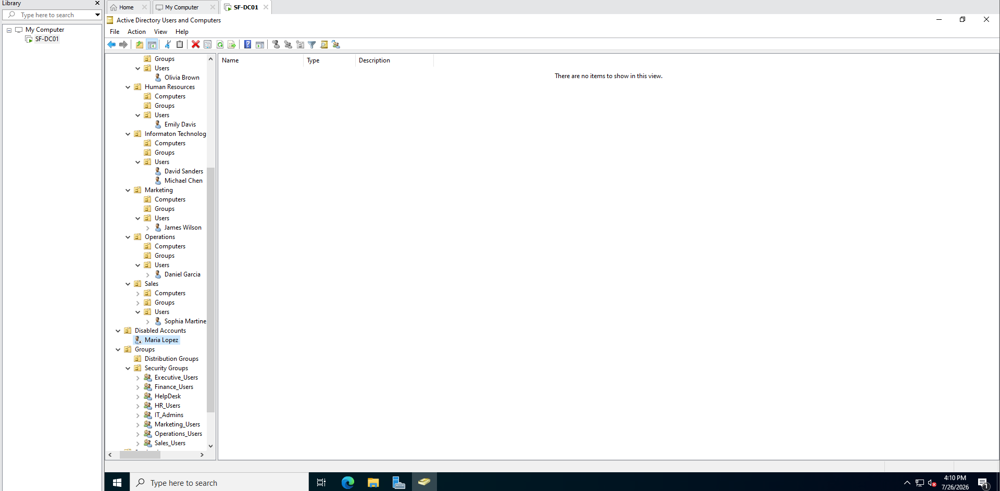

**Figure 11.** Disabled account retained within the Disabled Accounts Organizational Unit for future auditing and retention.

---

# Lessons Learned

This project demonstrated that identity management extends beyond creating and deleting user accounts.

Proper IAM operations require:

- Accurate identity information
- Controlled access through security groups
- Least privilege
- Timely access modification
- Secure offboarding
- Account retention for compliance and auditing

---

# Future Improvements

Future enhancements include:

- PowerShell-based user provisioning
- Bulk onboarding from CSV
- Automated lifecycle workflows
- Microsoft Entra ID synchronization
- Okta lifecycle management
- Identity governance workflows
- Approval automation
- Audit reporting
