# Project 07 – Microsoft Entra ID Identity Administration

## Overview

Project 07 extends the CyberLab Enterprise Infrastructure environment from on-premises identity management into cloud identity administration using Microsoft Entra ID.

This project demonstrates enterprise identity administration by creating cloud users, security groups, administrative roles, authentication methods, enterprise applications, and delegated administration within a Microsoft Entra tenant.

The objective was to simulate the responsibilities of an Identity and Access Management (IAM) Administrator responsible for managing cloud identities, authentication, authorization, and enterprise application access.

This project builds directly on the Active Directory infrastructure established in Projects 01–06 and represents the first phase of hybrid identity administration.

---

# Objectives

- Deploy a Microsoft Entra ID tenant
- Configure cloud identity administration
- Create enterprise users
- Create security groups
- Implement Role-Based Access Control (RBAC)
- Assign built-in administrative roles
- Create Administrative Units
- Configure authentication methods
- Register enterprise authentication methods
- Deploy an enterprise application
- Assign users to enterprise applications
- Explore Single Sign-On (SSO)
- Document cloud identity administration

---

# Environment

| Component | Configuration |
|---|---|
| Identity Platform | Microsoft Entra ID |
| Tenant Type | Microsoft Entra Free |
| Tenant Name | Default Directory |
| Primary Domain | `defense312gmail.onmicrosoft.com` |
| Identity Provider | Microsoft Entra ID |
| Authentication | Cloud Identity |
| Enterprise Application | GitHub Enterprise Cloud – Organization |

---

# Cloud Identity Architecture

Microsoft Entra ID extends enterprise identity management beyond the traditional Active Directory environment.

```text
                    CyberLab Enterprise Identity

               Windows Server 2022
                       │
                       ▼
          Active Directory Domain Services
                       │
                       ▼
              Microsoft Entra ID
                       │
      ┌────────────────┼────────────────┐
      ▼                ▼                ▼
 Enterprise Users  Security Groups  Administrative Roles
      │                │                │
      └────────────────┼────────────────┘
                       │
                       ▼
             Enterprise Applications
                       │
                       ▼
             Single Sign-On (SSO)
```

---

# Identity Administration

Enterprise cloud identities were created to mirror the existing on-premises Active Directory environment.

Cloud identities included:

- David Sanders
- Sarah Johnson
- Michael Chen
- Jessica Williams

Each identity was assigned to the appropriate business department through Microsoft Entra security groups.

---

# Security Groups

Security groups were created to support Role-Based Access Control.

Groups include:

```text
IT_Admins
HR_Users
Finance_Users
Sales_Users
```

Users were assigned according to department to simplify access management.

---

# Administrative Roles

Built-in Microsoft Entra administrative roles were explored.

The following role was assigned:

```text
User Administrator
```

This demonstrates delegated identity administration while avoiding unnecessary Global Administrator privileges.

---

# Administrative Units

An Administrative Unit named:

```text
IT Department
```

was created to demonstrate delegated administration at the organizational level.

Administrative Units allow organizations to delegate administrative responsibilities for specific departments without granting tenant-wide administrative permissions.

---

# Authentication Methods

Authentication management included:

- Phone Number
- Authentication Method Policies
- Multifactor Authentication review
- Temporary Access Pass evaluation

The project also documented licensing limitations associated with Microsoft Entra Free.

---

# Enterprise Applications

GitHub Enterprise Cloud – Organization was added as an Enterprise Application.

This demonstrates how Microsoft Entra manages Software-as-a-Service (SaaS) application access.

Administrative tasks included:

- Application deployment
- User assignment
- Single Sign-On review

---

# Single Sign-On

The project explored Microsoft Entra Single Sign-On configuration.

SAML configuration pages were reviewed to demonstrate enterprise application integration.

This project introduces concepts including:

- SAML
- OAuth
- OpenID Connect
- Enterprise federation

These technologies will be expanded during future projects.

---

# Identity Security

The Microsoft Entra Identity Secure Score dashboard was reviewed.

Security recommendations were evaluated to understand Microsoft's cloud identity security guidance.

Authentication policies were also reviewed to understand modern enterprise authentication controls.

---

# Screenshots

## Microsoft Entra Dashboard

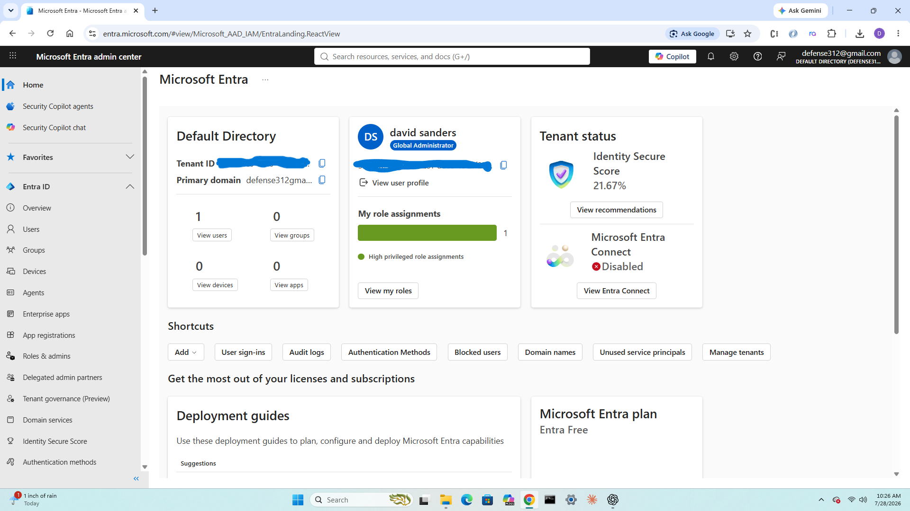

**Figure 1.** Microsoft Entra administration dashboard.

---

## Global Administrator


**Figure 2.** Verification of Global Administrator permissions.

---

## Enterprise Users

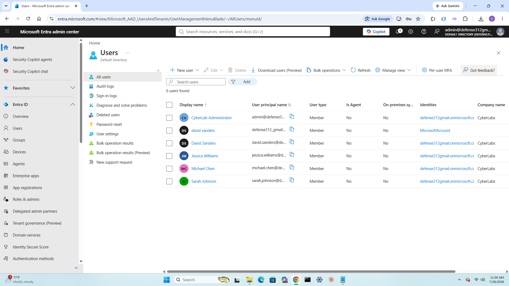

**Figure 3.** Cloud user administration.

---

## Security Groups

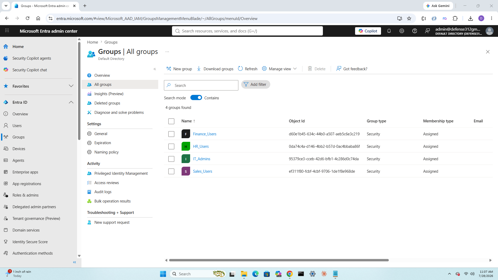

**Figure 4.** Department security groups.

---

## Group Membership

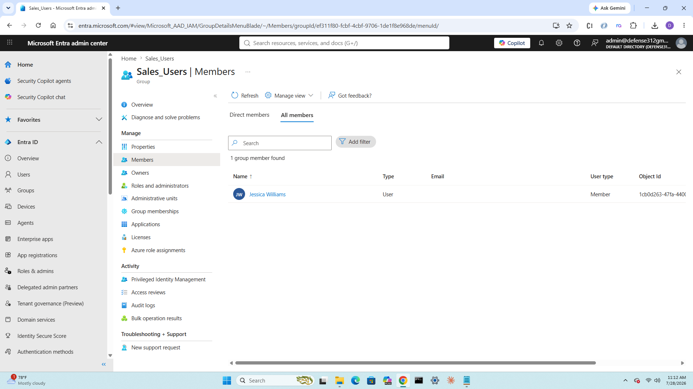

**Figure 5.** User assignment to security groups.

---

## Administrative Roles

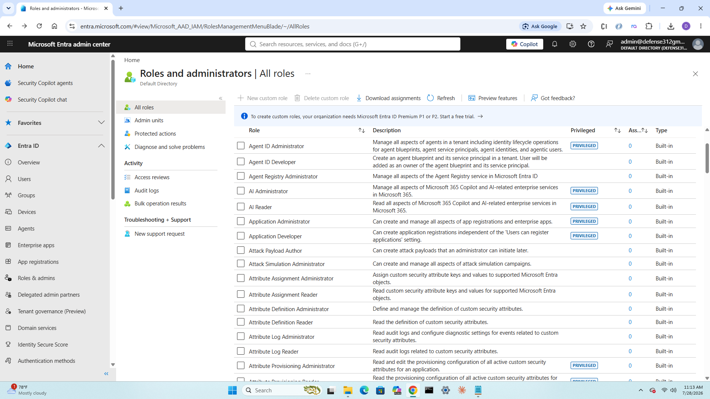

**Figure 6.** Built-in Microsoft Entra administrative roles.

---

## User Administrator Assignment

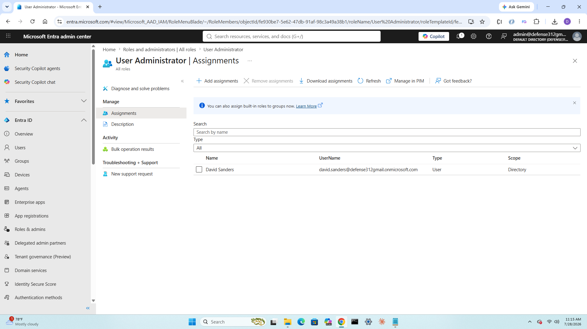

**Figure 7.** Delegated administrative role assignment.

---

## Administrative Unit

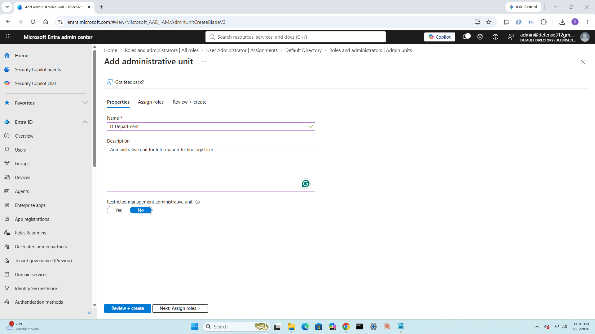

**Figure 8.** IT Department Administrative Unit.

---

## Administrative Unit User

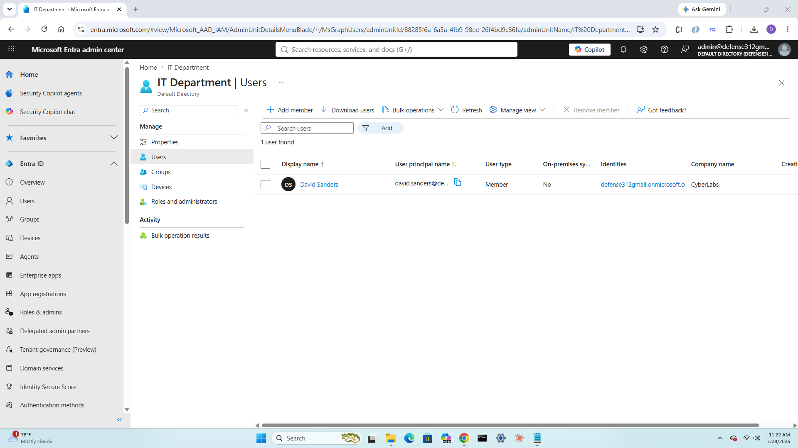

**Figure 9.** User assignment to Administrative Unit.

---

## Authentication Policies

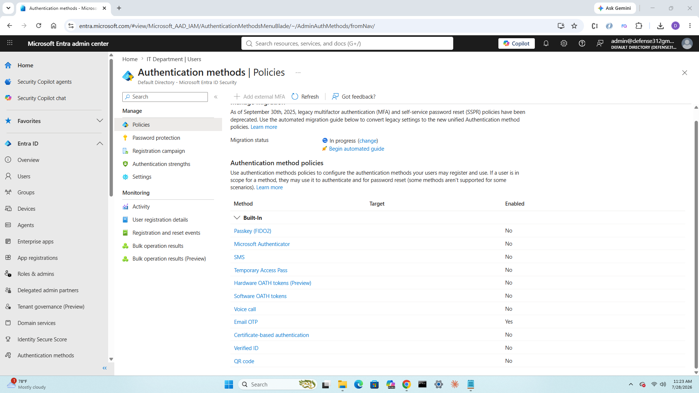

**Figure 10.** Authentication method configuration.

---

## Phone Authentication

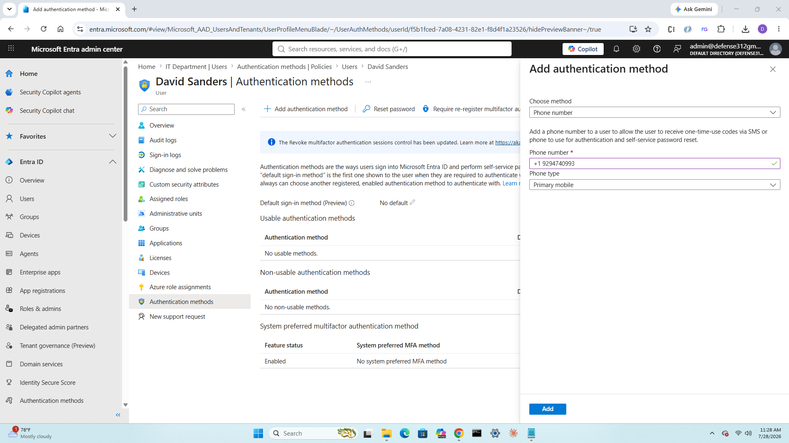

**Figure 11.** Phone authentication registration.

---

## Phone Authentication Configured

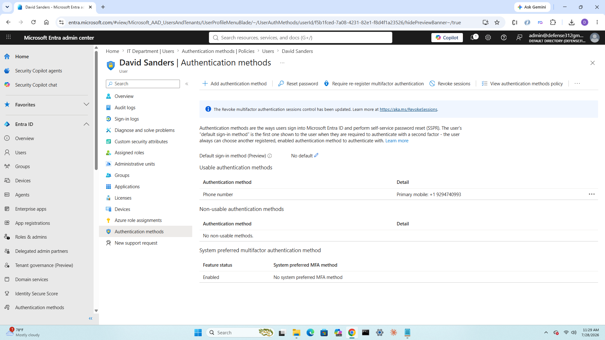

**Figure 12.** Registered authentication method.

---

## Temporary Access Pass

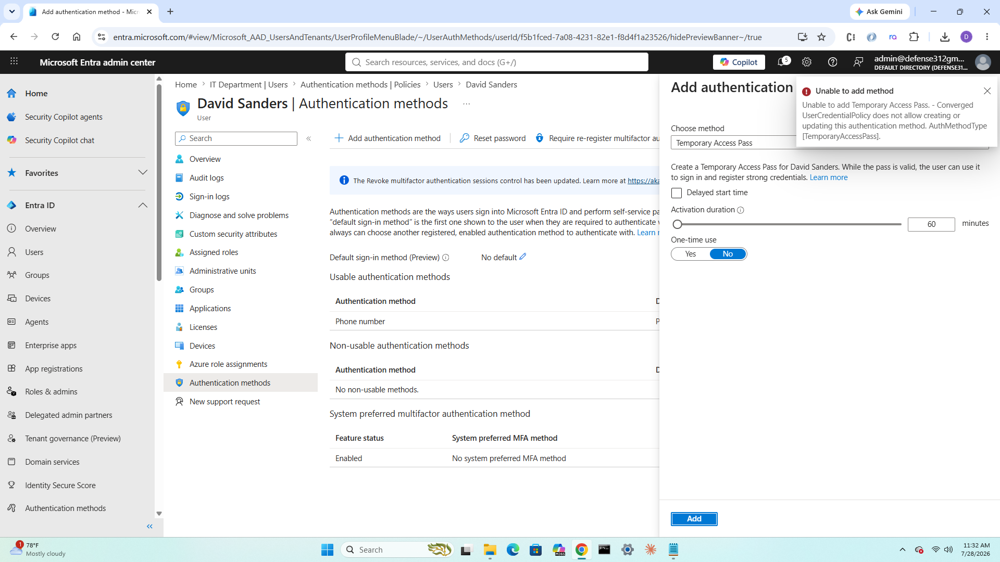

**Figure 13.** Temporary Access Pass evaluation and licensing considerations.

---

## Enterprise Application Gallery


**Figure 14.** Microsoft Entra Enterprise Application Gallery.

---

## Enterprise Application Overview

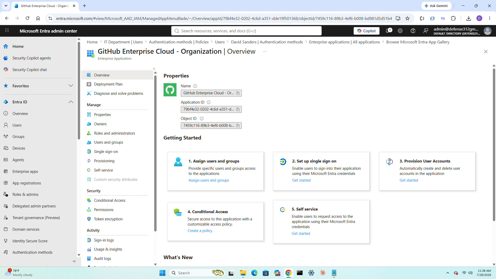

**Figure 15.** GitHub Enterprise Cloud application overview.

---

## Enterprise Application User Assignment


**Figure 16.** User assignment to Enterprise Application.

---

## GitHub Enterprise Assignment

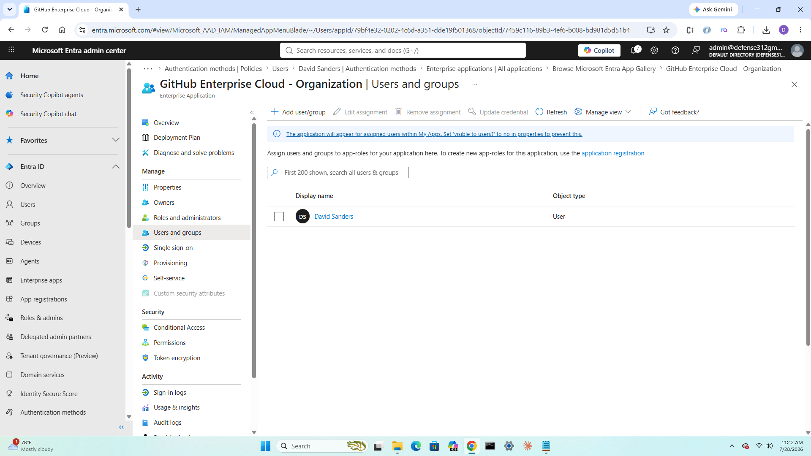

**Figure 17.** GitHub Enterprise user authorization.

---

# Skills Demonstrated

- Microsoft Entra ID
- Cloud Identity Administration
- User Administration
- Security Groups
- Role-Based Access Control
- Administrative Roles
- Administrative Units
- Authentication Methods
- Multifactor Authentication
- Enterprise Applications
- Single Sign-On
- Identity Governance Fundamentals
- SaaS Identity Administration
- Microsoft Cloud Administration
- Enterprise Documentation

---

# Current Validation Status

The Microsoft Entra tenant has been successfully configured and validated.

Completed functionality includes:

- Cloud user administration
- Security groups
- Administrative roles
- Administrative Units
- Authentication methods
- Enterprise Applications
- Application user assignments

The environment is now prepared for Project 08 – Okta Identity Cloud.

---

# Lessons Learned

This project demonstrated that modern enterprise identity management extends beyond traditional Active Directory.

Microsoft Entra provides centralized cloud identity administration, enterprise authentication, delegated administration, and SaaS application management.

The project also reinforced the importance of Role-Based Access Control, authentication methods, and centralized identity governance.

---

# Future Improvements

Planned enhancements include:

- Microsoft Entra Connect
- Hybrid Identity
- Okta Identity Cloud
- Conditional Access
- Self-Service Password Reset
- Identity Governance
- Access Reviews
- Microsoft Graph
- PowerShell Automation
- Lifecycle Workflows

---

# Outcome

Project 07 successfully expanded the CyberLab Enterprise Infrastructure environment into cloud identity management.

The completed Microsoft Entra environment demonstrates enterprise user administration, authentication management, delegated administration, and SaaS application integration while preparing the environment for hybrid identity and Okta implementation.